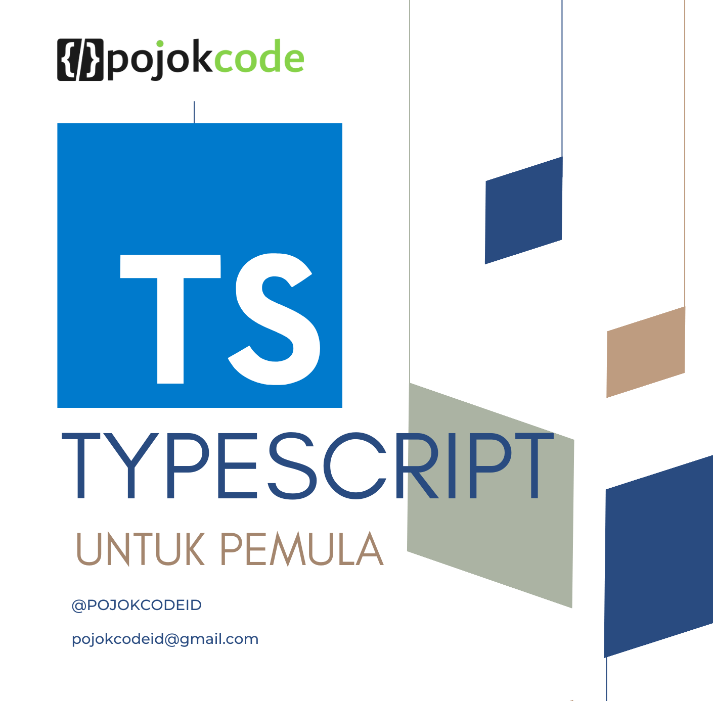

<div align="center">
  
# TYPESCRIPT

</div>



## CHECK BRANCH UNTUK FILE LATIHAN

## DAFTAR ISI

- [Sejarah Typescript](#SEJARAH-TYPESCRIPT)
- [Versi Typescript](#VERSI-TYPESCRIPT)
- [Menyiapkan Environement](#MENYIAPKAN-ENVIRONEMENT)
- [Apa itu Type di TYPESCRIPT](#APA-ITU-TYPE-DI-TYPESCRIPT)
- [TypeScript Annotations](#TypeScript-Annotations)
- [Cara Membuat Variabel](#CARA-MEMBUAT-VARIABEL)
- [Impicit dan Explicit Variable](#IMPICIT-DAN-EXPLICIT-VARIABLE)
- [Type Data Primitif](#TYPE-DATA-PRIMITIF)
- [Type Data Objek](#TYPE-DATA-OBJEK)
- [Type Data Tuples](#TYPE-DATA-TUPLES)
- [Type Data Enum](#TYPE-DATA-ENUM)
- [Type Data Union](#TYPE-DATA-UNION)
- [Type Data Any](#TYPE-DATA-ANY)
- [Type Data Never](#TYPE-DATA-NEVER)
- [Type Data Alias](#TYPE-DATA-ALIAS)
- [Type Data String Literal](#TYPE-DATA-STRING-LITERAL)
- [Type Data Void](#TYPE-DATA-VOID)
- [Operasi IF](#OPERASI-IF)
- [Operasi SWITCH](#OPERASI-SWITCH)
- [Operasi FOR LOOP](#OPERASI-FOR-LOOP)
- [Operasi WHILE LOOP](#OPERASI-WHILE-LOOP)
- [Operasi BREAK](#OPERASI-BREAK)
- [FUNCTION](#FUNCTION)
- [FUNCTION TYPES](#FUNCTION-TYPES)
- [OPTIONAL PARAMETER](#OPTIONAL-PARAMETER)
- [DEFAULT PARAMETER](#DEFAULT-PARAMETER)
- [REST PARAMETER](#REST-PARAMETER)
- [FUNCTION OVERLOADING](#FUNCTION-OVERLOADING)
- [CLASS](#CLASS)
- [ACCESS MODIFIER](#ACCESS-MODIFIER)
- [READONLY PROPERTY](#READONLY-PROPERTY)
- [INHERITANCE](#INHERITANCE)
- [STATIC METHOD DAN PROPERTIES](#STATIC-METHOD-DAN-PROPERTIES)
- [ABSTRACT CLASS](#ABSTRACT-CLASS)
- [INTERFACES](#INTERFACES)
- [EXTENDING INTERFACES](#EXTENDING-INTERFACES)
- [INTERSECTION TYPES](#INTERSECTION-TYPES)
- [TYPE GUARDS](#TYPE-GUARDS)
- [TYPE CASTING](#TYPE-CASTING)
- [TYPE ASSERTIONS](#TYPE-ASSERTIONS)
- [GENERIC TYPES](#GENERIC-TYPES)
- [GENERIC CONSTRAINTS](#GENERIC-CONSTRAINTS)
- [GENERIC INTERFACES](#GENERIC-INTERFACES)
- [GENERIC CLASSES](#GENERIC-CLASSES)

## SEJARAH TYPESCRIPT

TypeScript adalah bahasa pemrograman yang merupakan super-set dari JavaScript, artinya semua kode JavaScript adalah kode TypeScript juga. TypeScript menambahkan fitur-fitur seperti strong-typing, class, interface, dan module yang memudahkan pengembangan aplikasi berskala besar dengan JavaScript. TypeScript dikembangkan oleh Microsoft dan diperkenalkan pertama kali pada tahun 2012 oleh Anders Hejlsberg, yang juga dikenal sebagai pencipta bahasa C#. TypeScript dibuat untuk mengatasi kekurangan dan tantangan yang dihadapi oleh pengembang JavaScript, seperti kesulitan debugging, pengecekan tipe, dan kompatibilitas browser.

TypeScript menggunakan kompiler untuk mengubah kode TypeScript menjadi kode JavaScript yang dapat dijalankan oleh browser atau Node.js. TypeScript juga mendukung fitur-fitur terbaru dari ECMAScript, standar bahasa pemrograman yang diikuti oleh JavaScript. TypeScript dapat mengkompilasi fitur-fitur tersebut menjadi kode JavaScript yang sesuai dengan versi ECMAScript yang ditargetkan.

TypeScript memiliki banyak keunggulan dan manfaat bagi pengembang JavaScript, seperti:

- Meningkatkan produktivitas dan kualitas kode dengan adanya pengecekan tipe statis dan fitur OOP.
- Memudahkan pengembangan aplikasi kompleks dengan adanya class, interface, module, dan generics.
- Mempercepat proses debugging dan refactoring dengan adanya fitur intellisense dan autocomplete dari editor atau IDE.
- Menyediakan dukungan untuk fitur-fitur terbaru dari ECMAScript tanpa khawatir tentang kompatibilitas browser.
- Menyediakan kemampuan untuk menggunakan library atau framework JavaScript yang ada dengan adanya file definisi tipe.

## VERSI TYPESCRIPT

TypeScript adalah bahasa pemrograman yang dikembangkan oleh Microsoft dan diperkenalkan pertama kali pada Oktober 2012 dengan versi 0.8. TypeScript merupakan super-set dari JavaScript, artinya semua kode JavaScript adalah kode TypeScript juga. TypeScript menambahkan fitur-fitur seperti strong-typing, class, interface, module, dan generics yang memudahkan pengembangan aplikasi berskala besar dengan JavaScript. TypeScript menggunakan kompiler untuk mengubah kode TypeScript menjadi kode JavaScript yang dapat dijalankan oleh browser atau Node.js¹².

Sejak dirilis, TypeScript telah mengalami banyak perkembangan dan peningkatan. Versi-versi berikutnya dari TypeScript menambahkan dukungan untuk fitur-fitur baru dari ECMAScript, standar bahasa pemrograman yang diikuti oleh JavaScript. Beberapa fitur yang ditambahkan oleh TypeScript antara lain:

- Versi 0.9 (Juni 2013): menambahkan dukungan untuk generics, overloading constructor, dan union types³.
- Versi 1.0 (April 2014): menambahkan dukungan untuk enum, tuple, dan any types⁴.
- Versi 1.5 (Juli 2015): menambahkan dukungan untuk ES6 modules, arrow functions, destructuring, dan for..of loops⁵.
- Versi 1.6 (September 2015): menambahkan dukungan untuk class expressions, abstract classes, dan JSX⁶.
- Versi 1.7 (November 2015): menambahkan dukungan untuk async/await, exponentiation operator, dan rest parameters.
- Versi 1.8 (Januari 2016): menambahkan dukungan untuk string literal types, control flow analysis, dan type parameter constraints.
- Versi 2.0 (September 2016): menambahkan dukungan untuk non-nullable types, control flow based type analysis, dan tagged union types.
- Versi 2.1 (Desember 2016): menambahkan dukungan untuk object rest/spread properties, keyof and lookup types, dan mapped types.
- Versi 2.2 (Februari 2017): menambahkan dukungan untuk object type literals, mix-in classes, dan new.target.
- Versi 2.3 (April 2017): menambahkan dukungan untuk generic parameter defaults, async iterators/generators, dan error detection in unused labels and unreachable code.
- Versi 2.4 (Juni 2017): menambahkan dukungan untuk dynamic import expressions, string enums, weak type detection, dan improved inference for generics.
- Versi 2.5 (Agustus 2017): menambahkan dukungan untuk extract method/function refactoring, optional catch clause variables, dan improved narrowing for tagged unions.
- Versi 2.6 (Oktober 2017): menambahkan dukungan untuk strict function types, localized diagnostic messages, supress errors in .js files with @ts-ignore comments.
- Versi 2.7 (Januari 2018): menambahkan dukungan untuk definite assignment assertions, numeric separators, unique symbol types, dan fixed length tuples.
- Versi 2.8 (Maret 2018): menambahkan dukungan untuk conditional types, mapped types with keyof and mapped tuples with rest parameters.
- Versi 2.9 (Mei 2018): menambahkan dukungan untuk import.meta , number and symbol named properties with keyof and mapped types , generic type arguments in JSX elements , dan passing generic type arguments to tagged template strings .
- Versi 3.0 (Juli 2018): menambahkan dukungan untuk project references , extracting and spreading parameter lists with tuples , richer tuple types , unknown type , dan support for UMD global access .
- Versi 3.1 (September 2018): menambahkan dukungan untuk mappable tuple and array types , properties declarations on functions , version selection with typesVersions , dan refactoring to convert namespace import to named imports .
- Versi 3.2 (November 2018): menambahkan dukungan untuk strict bind call apply , object spread and rest on generic types , configuration inheritance via node_modules packages , dan improved narrowing for tagged unions with switch statements .
- Versi 3.3 (Januari 2019): menambahkan dukungan untuk incremental file watching , improved behavior for calling union types , dan improved excess property checks in union types .
- Versi 3.4 (Maret 2019): menambahkan dukungan untuk const assertions , higher order type inference from generic constructors , readonly array and tuple types , dan improved support for read-only arrays and tuples .
- Versi 3.5 (Mei 2019): menambahkan dukungan untuk Omit helper type , improved excess property checks in union types , smarter union type checking , dan improved speed and user experience for .js and .jsx files .
- Versi 3.6 (Agustus 2019): menambahkan dukungan untuk stricter generators , more accurate array spread , improved UX around promises , dan stricter checking for iterators and generator functions .
- Versi 3.7 (November 2019): menambahkan dukungan untuk optional chaining , nullish coalescing , assertion functions , better support for never-returning functions , dan declaration and out file emit ordering .
- Versi 3.8 (Februari 2020): menambahkan dukungan untuk private fields , export \* as ns syntax , top-level await , JSDoc property modifiers , dan type-only imports and exports .
- Versi 3.9 (Mei 2020): menambahkan dukungan untuk quick fixes for missing return expressions and unreachable code , improved inference with Promise.all and Promise.race , speed improvements in the compiler and editor , dan uncalled function checks in conditional expressions .
- Versi 4.0 (Agustus 2020): menambahkan dukungan untuk variadic tuple types , labeled tuple elements , class property inference from constructors , short-circuiting assignment operators , dan unknown on catch clause bindings .
- Versi 4.1 (November 2020): menambahkan dukungan untuk template literal types , key remapping in mapped types , recursive conditional types , JSDoc @see tag support , dan paths without baseUrl .
- Versi 4.2 (Februari 2021): menambahkan dukungan untuk smarter type alias preservation, leading/middle rest elements in tuple types, abstract construct signatures, relaxed rules between optional properties and string index signatures, dan --noPropertyAccessFromIndexSignature flag.
- Versi 4.3 (Mei 2021): menambahkan dukungan untuk override and the noImplicitOverride flag, template string type improvements, static index signatures, separate write types on properties, dan always-truthy promise checks.
- Versi 4.4 (Agustus 2021): menambahkan dukungan untuk control flow analysis of aliased conditions and discriminants, symbol and template string pattern index signatures, defaulting to the unknown type in catch variables, exact optional property types, dan performance improvements.

## MENYIAPKAN ENVIRONEMENT

Untuk menyiapkan environment untuk TypeScript, Anda perlu menginstal Node.js dan Visual Studio Code. Node.js adalah lingkungan run-time yang memungkinkan Anda menjalankan kode JavaScript di pihak server. Visual Studio Code adalah editor teks yang mendukung TypeScript dan fitur-fitur lainnya. Berikut adalah langkah-langkah yang perlu Anda lakukan:

1. Instal Node.js dari situs web resminya: https://nodejs.org/en/. Pilih versi LTS (Long Term Support) yang stabil dan andal. Ikuti petunjuk instalasi di layar.
2. Instal Visual Studio Code dari situs web resminya: https://code.visualstudio.com/. Pilih versi yang sesuai dengan sistem operasi Anda. Ikuti petunjuk instalasi di layar.
3. Buka Visual Studio Code dan buat folder baru untuk proyek TypeScript Anda. Anda bisa menggunakan menu File > Open Folder atau Ctrl+K Ctrl+O.
4. Buka terminal terintegrasi di Visual Studio Code dengan menu Terminal > New Terminal atau Ctrl+`.
5. Inisialisasi proyek npm dengan menjalankan perintah `npm init -y`. Ini akan membuat file package.json yang berisi informasi tentang proyek dan dependensi Anda.
6. Instal TypeScript sebagai dependensi pengembangan dengan menjalankan perintah `npm install -D typescript`. Ini akan menambahkan TypeScript ke file package.json dan folder node_modules.
7. Buat file konfigurasi TypeScript dengan nama tsconfig.json di folder proyek Anda. Anda bisa menggunakan menu File > New File atau Ctrl+N. Isi file tsconfig.json dengan opsi pengompilasi yang Anda inginkan, misalnya:

```json
{
  "compilerOptions": {
    "target": "es2016",
    "module": "commonjs",
    "outDir": "dist",
    "strict": true
  },
  "include": ["src/**/*"]
}
```

8. Buat folder src di folder proyek Anda untuk menyimpan file TypeScript Anda. Anda bisa menggunakan menu File > New Folder atau Ctrl+Shift+N.
9. Buat file TypeScript pertama Anda dengan nama index.ts di folder src. Anda bisa menggunakan menu File > New File atau Ctrl+N. Isi file index.ts dengan kode TypeScript yang Anda inginkan, misalnya:

```typescript
console.log("Hello, TypeScript!");
```

10. Tambahkan skrip npm untuk mengkompilasi dan menjalankan kode TypeScript Anda di file package.json, misalnya:

```json
"scripts": {
  "build": "tsc",
  "start": "node dist/index.js"
}
```

11. Jalankan perintah `npm run build` di terminal untuk mengkompilasi kode TypeScript menjadi kode JavaScript di folder dist.
12. Jalankan perintah `npm start` di terminal untuk menjalankan kode JavaScript yang dikompilasi.

Selamat, Anda telah menyiapkan environment untuk TypeScript! Sekarang Anda bisa menulis dan menjalankan kode TypeScript dengan mudah dan cepat.

## APA ITU TYPE DI TYPESCRIPT

Di TypeScript, type adalah cara mudah untuk merujuk ke berbagai properti dan fungsi yang dimiliki suatu nilai .
Nilai adalah segala sesuatu yang dapat Anda tetapkan ke variabel misalnya, angka, string, array, objek, dan fungsi.

Lihat nilai berikut:

```typescript
"Hello";
```

Saat Anda melihat nilai ini, Anda dapat mengatakan bahwa ini adalah string. Dan nilai ini memiliki properti dan metode yang dimiliki string.

```typescript
console.log("Hello".length); // 5
```

dan jujga meode lainnya, seperti

```typescript
console.log("Hello".toUpperCase()); // HELLO
```

Cara yang lebih singkat untuk merujuk ke suatu nilai adalah dengan menetapkannya sebagai tipe. Dalam contoh ini, Anda mengatakan ini 'Hello'adalah string. Kemudian, Anda tahu bahwa Anda dapat menggunakan properti dan metode string untuk nilainya 'Hello'.

Kesimpulannya, di TypeScript:

- type adalah label yang menjelaskan berbagai properti dan metode yang dimiliki suatu nilai
- setiap nilai memiliki tipe.

## TYPESCRIPT ANNOTATIONS

TypeScript Annotations adalah fitur yang memungkinkan kita untuk memberikan informasi tambahan tentang tipe data yang diharapkan oleh variabel, fungsi, objek, dan lain-lain. Annotations menggunakan bentuk @expression, di mana expression harus menghasilkan sebuah fungsi yang akan dipanggil saat runtime dengan informasi tentang deklarasi yang diberi annotation.

Ada dua jenis annotations yang umum digunakan di TypeScript, yaitu:

- **Type Annotations**: untuk menentukan tipe data secara eksplisit untuk variabel, fungsi, objek, dan lain-lain. Type Annotations menggunakan bentuk :type, di mana type bisa berupa tipe data bawaan atau buatan sendiri. Contoh:

```ts
// Mendeklarasikan variabel dengan tipe data string
let nama: string = "Budi";

// Mendeklarasikan fungsi dengan parameter dan nilai kembalian bertipe number
function tambah(a: number, b: number): number {
  return a + b;
}

// Mendeklarasikan objek dengan properti bertipe string dan number
let mobil: { merk: string; tahun: number } = {
  merk: "Toyota",
  tahun: 2020,
};
```

- **Decorators**: untuk menambahkan fitur tambahan seperti metadata, validasi, atau observasi ke kelas dan anggota kelas. Decorators menggunakan bentuk @expression, di mana expression harus menghasilkan sebuah fungsi yang akan dipanggil saat runtime dengan informasi tentang kelas atau anggota kelas yang diberi decorator. Contoh:

```ts
// Mendeklarasikan sebuah decorator factory
function color(value: string) {
  return function (target) {
    // logic for color decorator
  };
}

// Menggunakan decorator pada kelas
@color("red")
class Contoh {
  // logic for Contoh class
}
```

## CARA MEMBUAT VARIABEL
Variabel adalah sebuah tempat untuk menyimpan nilai dalam program. Cara penulisan variabel di TypeScript mengikuti aturan-aturan berikut:

- Variabel harus diawali dengan huruf, underscore (_), atau tanda dollar ($).
- Variabel tidak boleh mengandung spasi atau karakter spesial, kecuali underscore (_) atau tanda dollar ($).
- Variabel tidak boleh menggunakan kata kunci yang sudah ada di TypeScript, seperti `let`, `const`, `var`, `function`, `class`, `interface`, dll.
- Variabel bersifat case-sensitive, artinya membedakan huruf besar dan kecil. Misalnya, `nama` dan `Nama` adalah dua variabel yang berbeda.
- Variabel harus diberi nama yang jelas dan deskriptif, sesuai dengan nilai atau fungsi yang disimpan.

Cara menulis variabel dengan dua kata atau lebih di TypeScript adalah dengan menggunakan camelCase, yaitu cara penulisan dimana karakter pertama setiap kata ditulis dengan huruf besar, kecuali kata pertama. Contoh:

```typescript
let firstName = "Budi"; // variabel dengan satu kata
let lastName = "Santoso"; // variabel dengan satu kata
let fullName = firstName + " " + lastName; // variabel dengan dua kata
let birthDate = new Date(2000, 1, 1); // variabel dengan dua kata
let totalScore = 100; // variabel dengan dua kata
```

Cara menuliskan variabel di TypeScript adalah dengan menggunakan kata kunci **let**, **const**, atau **var**. Kata kunci **let** dan **const** adalah cara baru untuk mendeklarasikan variabel di TypeScript yang lebih disarankan daripada menggunakan kata kunci **var**. Perbedaan antara **let** dan **const** adalah bahwa **let** dapat diubah nilainya, sedangkan **const** tidak.

Contoh menuliskan variabel dengan **let**:

```typescript
let x: number; //Mendeklarasikan variabel x dengan type data number
x = 10; //Mengisi variabel x dengan nilai 10
x = 20; //Mengubah nilai variabel x menjadi 20
```

Contoh menuliskan variabel dengan **const**:

```typescript
const y: string = "Hello"; //Mendeklarasikan dan mengisi variabel y dengan type data string dan nilai "Hello"
y = "World"; //Error, tidak bisa mengubah nilai variabel y
```

Contoh menuliskan variabel dengan **var**:

```typescript
var z: boolean = true; //Mendeklarasikan dan mengisi variabel z dengan type data boolean dan nilai true
z = false; //Mengubah nilai variabel z menjadi false
```

Ketika menuliskan variabel di TypeScript, kita juga dapat menentukan type data dari variabel tersebut dengan menggunakan anotasi type. Anotasi type ditulis setelah nama variabel dengan tanda titik dua (:) dan nama type datanya. Contoh:

```typescript
let a: number; //Mendeklarasikan variabel a dengan type data number
let b: string = "Hello"; //Mendeklarasikan dan mengisi variabel b dengan type data string dan nilai "Hello"
let c: boolean = true; //Mendeklarasikan dan mengisi variabel c dengan type data boolean dan nilai true
```

Menentukan type data dari variabel dapat membantu kita untuk mencegah kesalahan penulisan nilai yang tidak sesuai dengan type data yang diharapkan. Jika kita tidak menentukan type data dari variabel, maka TypeScript akan menentukan type data secara implisit berdasarkan nilai awal yang diberikan. Contoh:

```typescript
let a = 10; //Type data number
let b = "Hello"; //Type data string
let c = true; //Type data boolean
```

## IMPICIT DAN EXPLICIT VARIABLE

Implicit dan explicit variable di TypeScript adalah dua cara untuk menentukan type data dari sebuah variabel. Implicit variable adalah variabel yang type datanya ditentukan secara otomatis oleh TypeScript berdasarkan nilai yang diberikan. Explicit variable adalah variabel yang type datanya ditentukan secara manual oleh programmer dengan menggunakan anotasi type.

Contoh implicit variable:

```typescript
let x = 10; //Type data number
let y = "Hello"; //Type data string
let z = true; //Type data boolean
```

Contoh explicit variable:

```typescript
let x: number = 10; //Type data number
let y: string = "Hello"; //Type data string
let z: boolean = true; //Type data boolean
```

Keuntungan dari menggunakan implicit variable adalah lebih fleksibel dan hemat waktu, karena tidak perlu menulis type data secara eksplisit. Keuntungan dari menggunakan explicit variable adalah lebih jelas dan mudah dibaca, karena type data terlihat secara eksplisit. Selain itu, explicit variable juga dapat mencegah kesalahan penulisan type data yang tidak sesuai dengan nilai yang diberikan.

## TYPE DATA PRIMITIF

Type data primitif di TypeScript adalah type data yang memiliki nilai yang tidak dapat diubah atau dimodifikasi. Type data primitif di TypeScript adalah:

- **number**: type data untuk menyimpan angka, baik bilangan bulat maupun desimal, termasuk notasi biner, heksadesimal, oktal, dan eksponensial. Contoh:

```typescript
let x: number;
x = 10; //Bilangan bulat
x = 3.14; //Bilangan desimal
x = 0b1010; //Bilangan biner
x = 0xff; //Bilangan heksadesimal
x = 1e3; //Bilangan eksponensial
```

- **string**: type data untuk menyimpan teks atau kumpulan karakter. Contoh:

```typescript
let s: string;
s = "Hello"; //String literal
s = "World"; //String literal
s = `Hello ${s}`; //String literal dengan template expression
```

- **boolean**: type data untuk menyimpan nilai logika, yaitu **true** atau **false**. Contoh:

```typescript
let b: boolean;
b = true; //Nilai benar
b = false; //Nilai salah
```

- **bigint**: type data untuk menyimpan angka yang lebih besar dari batas maksimum type data **number**, yaitu 2^53 - 1². Type data **bigint** ditandai dengan huruf **n** di akhir angka. Contoh:

```typescript
let big: bigint;
big = 9007199254740992n; //Angka lebih besar dari Number.MAX_SAFE_INTEGER
big = BigInt(9007199254740992); //Menggunakan konstruktor BigInt()
```

- **symbol**: type data untuk menyimpan nilai unik yang tidak dapat diubah. Type data **symbol** dibuat dengan menggunakan fungsi **Symbol()**. Contoh:

```typescript
let sym1: symbol;
let sym2: symbol;
sym1 = Symbol("key"); //Membuat symbol dengan deskripsi "key"
sym2 = Symbol("key"); //Membuat symbol lain dengan deskripsi "key"
console.log(sym1 === sym2); //false, karena setiap symbol bersifat unik
```

- **null**: type data untuk menyimpan nilai kosong atau tidak ada. Contoh:

```typescript
let n: null;
n = null; //Nilai null
```

- **undefined**: type data untuk menyimpan nilai yang belum didefinisikan. Contoh:

```typescript
let u: undefined;
u = undefined; //Nilai undefined
```

## TYPE DATA OBJEK

Tipe data objek di JavaScript adalah tipe data yang digunakan untuk menyimpan koleksi data atau entitas yang lebih kompleks. Objek bisa berisi properti dan metode yang menggambarkan karakteristik dan perilaku objek tersebut.

Contoh tipe data objek di JavaScript adalah:

- **Array**: untuk menyimpan kumpulan data dengan tipe yang sama atau berbeda dalam sebuah struktur terurut. Contoh:

```js
let fruits = ["apple", "banana", "orange"]; // array of strings
let numbers = [1, 2, 3, 4, 5]; // array of numbers
let mixed = [true, "hello", 3.14]; // array of mixed types
```

- **Date**: untuk menyimpan informasi tentang tanggal dan waktu. Contoh:

```js
let today = new Date(); // date object for current date and time
let birthday = new Date(2000, 0, 1); // date object for January 1, 2000
```

- **RegExp**: untuk menyimpan pola ekspresi reguler yang bisa digunakan untuk mencocokkan atau mengganti teks. Contoh:

```js
let emailPattern = /\w+@\w+\.\w+/; // regexp object for email pattern
let result = emailPattern.test("john@example.com"); // true
```

- **Function**: untuk menyimpan blok kode yang bisa dipanggil dengan parameter dan nilai kembalian tertentu. Contoh:

```js
function greet(name) {
  return "Hello, " + name;
} // function object for greeting

let message = greet("Budi"); // "Hello, Budi"
```

Selain itu, kita juga bisa membuat objek sendiri dengan menggunakan objek literal, konstruktor objek, atau Object.create(). Contoh:

```js
// objek literal
let person = {
  name: "Andi",
  age: 25,
  sayHello: function () {
    console.log("Hello, I'm " + this.name);
  },
};

// konstruktor objek
function Book(title, author, year) {
  this.title = title;
  this.author = author;
  this.year = year;
}

let book1 = new Book("The Hobbit", "J.R.R. Tolkien", 1937);

// Object.create()
let animal = {
  type: "mammal",
  eat: function () {
    console.log("Eating...");
  },
};

let dog = Object.create(animal);
dog.bark = function () {
  console.log("Woof!");
};
```

## TYPE DATA TUPLES

Tipe data tuple di TypeScript adalah tipe data yang digunakan untuk merepresentasikan kumpulan data dengan tipe yang berbeda-beda dan jumlah yang tetap. Tuple mirip dengan array, tetapi memiliki beberapa perbedaan, yaitu:

- Tuple memiliki panjang yang tetap, sedangkan array bisa berubah-ubah.
- Tuple memiliki tipe data yang sudah ditentukan untuk setiap indeksnya, sedangkan array bisa memiliki tipe data apapun untuk setiap elemennya.
- Tuple bisa memiliki nama untuk setiap elemennya, sedangkan array tidak.

Contoh tipe data tuple di TypeScript adalah sebagai berikut:

```ts
// Mendeklarasikan tuple dengan tiga elemen bertipe string, number, dan boolean
let user: [string, number, boolean] = ["Budi", 25, true];

// Mendeklarasikan tuple dengan nama elemen
let point: [x: number, y: number] = [10, 20];

// Mendeklarasikan tuple dengan elemen opsional
let person: [name: string, age?: number] = ["Andi"];

// Mendeklarasikan tuple dengan elemen sisa bertipe number
let numbers: [first: number, second: number, ...rest: number[]] = [
  1, 2, 3, 4, 5,
];
```

## TYPE DATA ENUM

Tipe data enum di TypeScript adalah tipe data yang digunakan untuk merepresentasikan himpunan nilai konstan yang sudah ditentukan sebelumnya. Enum memungkinkan kita untuk memberikan nama yang bermakna untuk nilai-nilai tersebut, sehingga lebih mudah untuk mendokumentasikan maksud atau membuat sekumpulan kasus yang berbeda. TypeScript menyediakan enum numerik dan string, atau bahkan keduanya.

Contoh tipe data enum di TypeScript adalah sebagai berikut:

```ts
// Mendeklarasikan enum numerik
enum Direction {
  Up = 1,
  Down,
  Left,
  Right,
}

// Mendeklarasikan enum string
enum Color {
  Red = "RED",
  Green = "GREEN",
  Blue = "BLUE",
}

// Mendeklarasikan enum heterogen
enum BooleanLikeHeterogeneousEnum {
  No = 0,
  Yes = "YES",
}

// Menggunakan enum
let dir: Direction = Direction.Up;
let col: Color = Color.Red;
let ans: BooleanLikeHeterogeneousEnum = BooleanLikeHeterogeneousEnum.Yes;
```

## TYPE DATA UNION

Tipe data union di TypeScript adalah tipe data yang digunakan untuk merepresentasikan nilai yang bisa memiliki salah satu dari beberapa tipe yang sudah ditentukan sebelumnya. Union memungkinkan kita untuk memberikan fleksibilitas dan ekspresivitas dalam kode, karena sebuah variabel atau parameter fungsi bisa memiliki lebih dari satu tipe.

Contoh tipe data union di TypeScript adalah sebagai berikut:

```ts
// Mendeklarasikan union antara string dan number
let code: string | number;

// Menginisialisasi dengan string
code = "404";

// Menginisialisasi dengan number
code = 404;

// Menginisialisasi dengan boolean akan menimbulkan error
code = true; // Error: Type 'boolean' is not assignable to type 'string | number'

// Mendeklarasikan fungsi dengan parameter union
function printStatusCode(code: string | number) {
  console.log(`My status code is ${code}.`);
}

// Memanggil fungsi dengan string
printStatusCode("404");

// Memanggil fungsi dengan number
printStatusCode(404);

// Memanggil fungsi dengan boolean akan menimbulkan error
printStatusCode(true); // Error: Argument of type 'boolean' is not assignable to parameter of type 'string | number'
```

## TYPE DATA ANY

Tipe data any di TypeScript adalah tipe data yang digunakan untuk merepresentasikan nilai yang bisa memiliki tipe apapun. Tipe data any digunakan ketika kita berurusan dengan program pihak ketiga dan mengharapkan variabel apapun tetapi kita tidak tahu tipe pasti dari variabel tersebut. Tipe data any digunakan karena membantu kita untuk memilih dan meninggalkan pemeriksaan tipe saat kompilasi.

Contoh tipe data any di TypeScript adalah sebagai berikut:

```ts
// Mendeklarasikan variabel dengan tipe data any
let something: any = "Hello World!";

// Mengubah nilai dengan tipe data berbeda
something = 23;
something = true;

// Mendeklarasikan array dengan tipe data any
let arr: any[] = ["John", 212, true];

// Menambahkan elemen dengan tipe data berbeda
arr.push("Smith");
```

## TYPE DATA NEVER

Tipe data never di TypeScript adalah tipe data yang digunakan untuk merepresentasikan nilai yang tidak pernah terjadi. Tipe data never digunakan ketika kita yakin bahwa sesuatu tidak akan pernah terjadi. Misalnya, kita menulis sebuah fungsi yang tidak akan pernah mengembalikan nilai atau selalu melempar sebuah eksepsi.

Contoh tipe data never di TypeScript adalah sebagai berikut:

```ts
// Mendeklarasikan fungsi yang melempar eksepsi dan tidak mengembalikan nilai
function throwError(errorMsg: string): never {
  throw new Error(errorMsg);
}

// Mendeklarasikan fungsi yang selalu melakukan sesuatu dan tidak pernah berakhir
function keepProcessing(): never {
  while (true) {
    console.log("I always does something and never ends.");
  }
}

// Mendeklarasikan variabel dengan tipe data never
let nothing: never;

// Menginisialisasi dengan nilai apapun akan menimbulkan error
nothing = null; // Error: Type 'null' is not assignable to type 'never'
nothing = 0; // Error: Type 'number' is not assignable to type 'never'
nothing = "hello"; // Error: Type 'string' is not assignable to type 'never'
```

## TYPE DATA ALIAS

Tipe data alias di TypeScript adalah kemampuan untuk memberikan nama alternatif atau alias untuk tipe data yang sudah ada di TypeScript. Dengan menggunakan tipe data alias, kita dapat membuat tipe data yang lebih mudah dimengerti dan digunakan di seluruh kode program.

Contoh tipe data alias di TypeScript adalah sebagai berikut:

```ts
// Mendeklarasikan alias untuk tipe string
type Name = string;

// Menggunakan alias untuk variabel
let firstName: Name = "Budi";
let lastName: Name = "Santoso";

// Mendeklarasikan alias untuk tipe union
type Status = "active" | "inactive" | "pending";

// Menggunakan alias untuk variabel
let userStatus: Status = "active";
let orderStatus: Status = "pending";

// Mendeklarasikan alias untuk tipe objek
type User = {
  name: string;
  age: number;
  status: Status;
};

// Menggunakan alias untuk variabel
let user: User = {
  name: "Andi",
  age: 30,
  status: "inactive",
};
```

## TYPE DATA STRING LITERAL

TypeScript String Literal tipe adalah tipe data yang digunakan untuk merepresentasikan nilai string yang pasti. Tipe data ini memiliki sintaks yang sama dengan string literal di JavaScript, tetapi digunakan di posisi tipe. Dengan menggunakan tipe data ini, kita dapat membatasi nilai string yang bisa diterima oleh variabel, fungsi, objek, dan lain-lain.

Contoh TypeScript String Literal tipe adalah sebagai berikut:

```ts
// Mendeklarasikan variabel dengan tipe data string literal
let hello: "Hello" = "Hello";

// Mengubah nilai dengan string literal yang sama
hello = "Hello";

// Mengubah nilai dengan string literal yang berbeda akan menimbulkan error
hello = "Hi"; // Error: Type '"Hi"' is not assignable to type '"Hello"'

// Mendeklarasikan fungsi dengan parameter dan nilai kembalian bertipe string literal
function greet(greeting: "Hello" | "Hi" | "Good morning"): "Greetings!" {
  console.log(greeting);
  return "Greetings!";
}

// Memanggil fungsi dengan string literal yang sesuai
greet("Hello"); // OK
greet("Hi"); // OK
greet("Good morning"); // OK

// Memanggil fungsi dengan string literal yang tidak sesuai akan menimbulkan error
greet("Bye"); // Error: Argument of type '"Bye"' is not assignable to parameter of type '"Hello" | "Hi" | "Good morning"'
```

## TYPE DATA VOID

Tipe data void di TypeScript adalah tipe data yang digunakan untuk merepresentasikan nilai kembalian dari fungsi yang tidak mengembalikan nilai apa-apa atau pernyataan return yang tidak mengembalikan apa-apa. Tipe data ini biasanya digunakan sebagai tipe kembalian dari fungsi yang hanya melakukan suatu aksi tanpa menghasilkan suatu nilai.

Contoh tipe data void di TypeScript adalah sebagai berikut:

```ts
// Mendeklarasikan fungsi dengan tipe kembalian void
function sayHello(name: string): void {
  console.log("Hello, " + name);
}

// Memanggil fungsi
sayHello("Budi");

// Mendeklarasikan variabel dengan tipe data void
let nothing: void;

// Menginisialisasi dengan undefined
nothing = undefined;

// Menginisialisasi dengan null jika strictNullChecks diatur false
nothing = null;

// Menginisialisasi dengan nilai lain akan menimbulkan error
nothing = 0; // Error: Type 'number' is not assignable to type 'void'
nothing = "hello"; // Error: Type 'string' is not assignable to type 'void'
```

- rujukan https://www.typescriptlang.org/docs/handbook/basic-types.html

## OPERASI IF

TypeScript if adalah pernyataan yang digunakan untuk mengeksekusi suatu blok kode berdasarkan kondisi tertentu. Jika kondisi bernilai true, maka blok kode di dalam if akan dieksekusi. Jika kondisi bernilai false, maka blok kode di dalam if akan dilewati.

Contoh TypeScript if adalah sebagai berikut:

```ts
// Mendeklarasikan variabel dengan tipe data number
let x: number = 10;
let y: number = 20;

// Menggunakan if untuk memeriksa kondisi
if (x > y) {
  // Blok kode ini akan dieksekusi jika x lebih besar dari y
  console.log("x is greater than y");
}

if (x < y) {
  // Blok kode ini akan dieksekusi jika x lebih kecil dari y
  console.log("x is less than y");
}
```

TypeScript juga mendukung if...else dan if...else if...else untuk mengeksekusi blok kode alternatif jika kondisi di dalam if tidak terpenuhi.

Contoh TypeScript if...else dan if...else if...else adalah sebagai berikut:

```ts
// Mendeklarasikan variabel dengan tipe data number
let x: number = 10;
let y: number = 20;

// Menggunakan if...else untuk memeriksa kondisi
if (x > y) {
  // Blok kode ini akan dieksekusi jika x lebih besar dari y
  console.log("x is greater than y");
} else {
  // Blok kode ini akan dieksekusi jika x tidak lebih besar dari y
  console.log("x is less than or equal to y");
}

// Menggunakan if...else if...else untuk memeriksa kondisi
if (x > y) {
  // Blok kode ini akan dieksekusi jika x lebih besar dari y
  console.log("x is greater than y");
} else if (x < y) {
  // Blok kode ini akan dieksekusi jika x lebih kecil dari y
  console.log("x is less than y");
} else {
  // Blok kode ini akan dieksekusi jika x sama dengan y
  console.log("x is equal to y");
}
```

TypeScript juga mendukung operator ternary ?: untuk mengeksekusi salah satu dari dua ekspresi berdasarkan kondisi tertentu.

Contoh TypeScript operator ternary ?: adalah sebagai berikut:

```ts
// Mendeklarasikan variabel dengan tipe data number
let x: number = 10;
let y: number = 20;

// Menggunakan operator ternary ?: untuk memeriksa kondisi
x > y
  ? console.log("x is greater than y")
  : console.log("x is less than or equal to y");
```

## OPERASI SWITCH

TypeScript switch adalah pernyataan yang digunakan untuk mengeksekusi salah satu dari beberapa blok kode berdasarkan nilai atau ekspresi tertentu. Switch memungkinkan kita untuk menulis kode yang lebih rapi dan mudah dibaca daripada menggunakan if...else if...else yang berulang-ulang.

Sintax Dasar:

```ts
switch (expression) {
  case constant - expression1: {
    //statements;
    break;
  }
  case constant_expression2: {
    //statements;
    break;
  }
  default: {
    //statements;
    break;
  }
}
```

Contoh TypeScript switch adalah sebagai berikut:

```ts
// Mendeklarasikan variabel dengan tipe data string
let day: string = "Monday";

// Menggunakan switch untuk memeriksa nilai variabel
switch (day) {
  case "Monday":
    // Blok kode ini akan dieksekusi jika day bernilai "Monday"
    console.log("Today is Monday");
    break;
  case "Tuesday":
    // Blok kode ini akan dieksekusi jika day bernilai "Tuesday"
    console.log("Today is Tuesday");
    break;
  case "Wednesday":
    // Blok kode ini akan dieksekusi jika day bernilai "Wednesday"
    console.log("Today is Wednesday");
    break;
  case "Thursday":
    // Blok kode ini akan dieksekusi jika day bernilai "Thursday"
    console.log("Today is Thursday");
    break;
  case "Friday":
    // Blok kode ini akan dieksekusi jika day bernilai "Friday"
    console.log("Today is Friday");
    break;
  case "Saturday":
    // Blok kode ini akan dieksekusi jika day bernilai "Saturday"
    console.log("Today is Saturday");
    break;
  case "Sunday":
    // Blok kode ini akan dieksekusi jika day bernilai "Sunday"
    console.log("Today is Sunday");
    break;
  default:
    // Blok kode ini akan dieksekusi jika day tidak bernilai salah satu dari case di atas
    console.log("Invalid day");
}
```

TypeScript juga mendukung pengelompokan beberapa case yang memiliki blok kode yang sama. Hal ini berguna untuk menghindari duplikasi kode.

Contoh TypeScript pengelompokan case adalah sebagai berikut:

```ts
// Mendeklarasikan variabel dengan tipe data number
let month: number = 2;

// Menggunakan switch untuk memeriksa nilai variabel
switch (month) {
  case 1:
  case 3:
  case 5:
  case 7:
  case 8:
  case 10:
  case 12:
    // Blok kode ini akan dieksekusi jika month bernilai salah satu dari case di atas
    console.log("This month has 31 days");
    break;
  case 4:
  case 6:
  case 9:
  case 11:
    // Blok kode ini akan dieksekusi jika month bernilai salah satu dari case di atas
    console.log("This month has 30 days");
    break;
  case 2:
    // Blok kode ini akan dieksekusi jika month bernilai 2
    console.log("This month has either 28 or 29 days");
    break;
  default:
    // Blok kode ini akan dieksekusi jika month tidak bernilai salah satu dari case di atas
    console.log("Invalid month");
}
```

## OPERASI FOR LOOP

TypeScript for loop adalah perulangan yang digunakan untuk mengeksekusi suatu blok kode secara berulang-ulang selama kondisi tertentu terpenuhi. For loop memiliki sintaks yang terdiri dari tiga bagian, yaitu inisialisasi, kondisi, dan inkremen.

Sintax dasar :

```ts
for (first expression; second expression; third expression ) {
    // statements to be executed repeatedly
}
```

Contoh TypeScript for loop adalah sebagai berikut:

```ts
// Mendeklarasikan variabel dengan tipe data number
let sum: number = 0;

// Menggunakan for loop untuk menjumlahkan angka dari 1 sampai 10
for (let i: number = 1; i <= 10; i++) {
  // Blok kode ini akan dieksekusi sebanyak 10 kali
  sum += i; // Menambahkan nilai i ke sum
}

// Menampilkan hasil penjumlahan
console.log(sum); // 55
```

TypeScript juga mendukung for...of loop dan for...in loop untuk mengulangi elemen-elemen dari suatu koleksi seperti array, string, map, set, dan lain-lain.

Contoh TypeScript for...of loop adalah sebagai berikut:

```ts
// Mendeklarasikan array dengan tipe data string
let fruits: string[] = ["apple", "banana", "orange"];

// Menggunakan for...of loop untuk menampilkan setiap elemen array
for (let fruit of fruits) {
  // Blok kode ini akan dieksekusi sebanyak jumlah elemen array
  console.log(fruit); // apple, banana, orange
}
```

Contoh TypeScript for...in loop adalah sebagai berikut:

```ts
// Mendeklarasikan objek dengan tipe data any
let person: any = {
  name: "Budi",
  age: 25,
  gender: "male",
};

// Menggunakan for...in loop untuk menampilkan setiap properti objek
for (let key in person) {
  // Blok kode ini akan dieksekusi sebanyak jumlah properti objek
  console.log(key + ": " + person[key]); // name: Budi, age: 25, gender: male
}
```

## OPERASI WHILE LOOP

TypeScript while loop adalah perulangan yang digunakan untuk mengeksekusi suatu blok kode selama kondisi tertentu bernilai truthy. While loop akan mengevaluasi kondisi sebelum memasuki blok kode. Jika kondisi bernilai truthy, maka blok kode akan dieksekusi. Jika kondisi bernilai falsy, maka perulangan akan berhenti.

Sintax dasar :

```ts
while (condition expression) {
    // code block to be executed
}
```

Contoh TypeScript while loop adalah sebagai berikut:

```ts
// Mendeklarasikan variabel dengan tipe data number
let i: number = 1;

// Menggunakan while loop untuk menampilkan angka dari 1 sampai 5
while (i <= 5) {
  // Blok kode ini akan dieksekusi selama i kurang dari atau sama dengan 5
  console.log(i); // 1, 2, 3, 4, 5
  i++; // Menambahkan nilai i sebesar 1
}
```

TypeScript juga mendukung do...while loop yang mirip dengan while loop, namun mengevaluasi kondisi setelah memasuki blok kode. Do...while loop akan mengeksekusi blok kode setidaknya sekali sebelum mengecek kondisi.

Contoh TypeScript do...while loop adalah sebagai berikut:

```ts
// Mendeklarasikan variabel dengan tipe data number
let i: number = 1;

// Menggunakan do...while loop untuk menampilkan angka dari 1 sampai 5
do {
  // Blok kode ini akan dieksekusi setidaknya sekali sebelum mengecek kondisi
  console.log(i); // 1, 2, 3, 4, 5
  i++; // Menambahkan nilai i sebesar 1
} while (i <= 5); // Kondisi yang dievaluasi setelah blok kode
```

## OPERASI BREAK

TypeScript break adalah pernyataan yang digunakan untuk menghentikan atau keluar dari suatu perulangan, switch, atau blok berlabel. Break berguna untuk mengakhiri perulangan lebih awal ketika kondisi tertentu terjadi. Break akan memindahkan kontrol program ke pernyataan selanjutnya setelah perulangan, switch, atau blok berlabel.

Contoh TypeScript break dalam perulangan adalah sebagai berikut:

```ts
// Mendeklarasikan variabel dengan tipe data number
let i: number = 1;

// Menggunakan while loop untuk menampilkan angka dari 1 sampai 5
while (i <= 5) {
  // Blok kode ini akan dieksekusi selama i kurang dari atau sama dengan 5
  console.log(i); // 1, 2, 3
  i++; // Menambahkan nilai i sebesar 1
  if (i > 3) {
    // Menggunakan break untuk menghentikan perulangan jika i lebih besar dari 3
    break;
  }
}
```

Contoh TypeScript break dalam switch adalah sebagai berikut:

```ts
// Mendeklarasikan variabel dengan tipe data string
let day: string = "Monday";

// Menggunakan switch untuk mengecek nilai variabel
switch (day) {
  case "Monday":
    // Blok kode ini akan dieksekusi jika day bernilai "Monday"
    console.log("Today is Monday");
    break; // Menggunakan break untuk keluar dari switch
  case "Tuesday":
    // Blok kode ini tidak akan dieksekusi karena sudah keluar dari switch
    console.log("Today is Tuesday");
    break;
  case "Wednesday":
    // Blok kode ini tidak akan dieksekusi karena sudah keluar dari switch
    console.log("Today is Wednesday");
    break;
}
```

## FUNCTION

Functions di TypeScript adalah blok kode yang dapat dipanggil berulang kali dengan memberikan input dan menghasilkan output. Functions di TypeScript dapat didefinisikan dengan sintaks yang sama dengan JavaScript, yaitu menggunakan kata kunci function, atau dengan menggunakan arrow function.

Perintah dasarnya:

```ts
function name(parameter: type, parameter:type,...): returnType {
   // do something
}
```

Contoh Functions di TypeScript adalah sebagai berikut:

```ts
// Mendefinisikan fungsi dengan kata kunci function
function add(a: number, b: number): number {
  return a + b;
}

// Mendefinisikan fungsi dengan arrow function
const multiply = (a: number, b: number): number => {
  return a * b;
};

// Memanggil fungsi
console.log(add(2, 3)); // 5
console.log(multiply(2, 3)); // 6
```

Functions di TypeScript juga dapat memiliki tipe data yang eksplisit untuk parameter dan nilai kembalian. Tipe data parameter ditulis setelah nama parameter, sedangkan tipe data nilai kembalian ditulis setelah tanda kurung.

Contoh Functions dengan tipe data eksplisit adalah sebagai berikut:

```ts
// Mendefinisikan fungsi dengan tipe data eksplisit untuk parameter dan nilai kembalian
function greet(name: string): string {
  return "Hello, " + name;
}

// Memanggil fungsi
console.log(greet("Budi")); // Hello, Budi
```

Functions di TypeScript juga dapat memiliki parameter opsional, parameter default, parameter rest, dan lain-lain.

## FUNCTION TYPES

Function Types di TypeScript adalah tipe data yang digunakan untuk mendeskripsikan tipe dari fungsi, yaitu parameter dan nilai kembalian. Function Types dapat ditulis dengan menggunakan function type expression, call signature, construct signature, atau type alias.

Contoh Function Types dengan function type expression adalah sebagai berikut:

```ts
// Mendeklarasikan variabel dengan function type expression
let add: (a: number, b: number) => number;

// Menginisialisasi variabel dengan fungsi yang sesuai dengan tipe data
add = function (a: number, b: number) {
  return a + b;
};

// Memanggil fungsi
console.log(add(2, 3)); // 5
```

Contoh Function Types dengan call signature adalah sebagai berikut:

```ts
// Mendeklarasikan interface dengan call signature
interface GreetFunction {
  (name: string): string;
}

// Mendeklarasikan variabel dengan tipe data interface
let greet: GreetFunction;

// Menginisialisasi variabel dengan fungsi yang sesuai dengan tipe data
greet = function (name: string) {
  return "Hello, " + name;
};

// Memanggil fungsi
console.log(greet("Budi")); // Hello, Budi
```

Contoh Function Types dengan construct signature adalah sebagai berikut:

```ts
// Mendeklarasikan interface dengan construct signature
interface PersonConstructor {
  new (name: string): Person;
}

// Mendeklarasikan kelas yang sesuai dengan construct signature
class Person {
  name: string;
  constructor(name: string) {
    this.name = name;
  }
}

// Mendeklarasikan variabel dengan tipe data interface
let personFactory: PersonConstructor;

// Menginisialisasi variabel dengan kelas yang sesuai dengan tipe data
personFactory = Person;

// Membuat objek baru dengan menggunakan variabel
let person = new personFactory("Budi");

// Menampilkan properti objek
console.log(person.name); // Budi
```

Contoh Function Types dengan type alias adalah sebagai berikut:

```ts
// Mendeklarasikan type alias untuk function type expression
type AddFunction = (a: number, b: number) => number;

// Mendeklarasikan variabel dengan tipe data type alias
let add: AddFunction;

// Menginisialisasi variabel dengan fungsi yang sesuai dengan tipe data
add = function (a: number, b: number) {
  return a + b;
};

// Memanggil fungsi
console.log(add(2, 3)); // 5
```

## OPTIONAL PARAMETER

Optional Parameters di TypeScript adalah parameter yang dapat diabaikan saat memanggil fungsi. Optional Parameters ditandai dengan tanda tanya (?) setelah nama parameter. TypeScript tidak akan memeriksa jumlah dan tipe argumen untuk parameter opsional, tetapi hanya untuk parameter yang wajib. Parameter opsional yang tidak diberikan nilai akan mendapatkan nilai undefined.

Contoh Optional Parameters di TypeScript adalah sebagai berikut:

```ts
// Mendefinisikan fungsi dengan parameter opsional c
function add(a: number, b: number, c?: number): number {
  if (typeof c !== "undefined") {
    // Jika c diberikan nilai, maka tambahkan ke hasil
    return a + b + c;
  } else {
    // Jika c tidak diberikan nilai, maka kembalikan a + b saja
    return a + b;
  }
}

// Memanggil fungsi dengan dua argumen
console.log(add(2, 3)); // 5

// Memanggil fungsi dengan tiga argumen
console.log(add(2, 3, 4)); // 9
```

Optional Parameters harus diletakkan setelah parameter wajib dalam daftar parameter. Jika tidak, TypeScript akan mengeluarkan error.

Contoh error saat meletakkan parameter opsional sebelum parameter wajib adalah sebagai berikut:

```ts
// Mendefinisikan fungsi dengan parameter opsional a dan parameter wajib b
function multiply(a?: number, b: number): number {
  // Error: A required parameter cannot follow an optional parameter.
  return a * b;
}
```

## DEFAULT PARAMETER

Default Parameters di TypeScript adalah parameter yang memiliki nilai awal yang ditentukan jika parameter tersebut tidak diberikan nilai atau bernilai undefined saat memanggil fungsi. Default Parameters dapat ditulis dengan menggunakan tanda sama dengan (=) diikuti dengan nilai default setelah tipe data parameter. TypeScript juga dapat menentukan tipe data parameter default dari nilai default tersebut. Default Parameters dapat membantu kita menghindari memberikan nilai parameter yang berulang-ulang atau tidak perlu saat memanggil fungsi.

Contoh Default Parameters di TypeScript adalah sebagai berikut:

```ts
// Mendefinisikan fungsi dengan parameter default discount
function applyDiscount(price: number, discount: number = 0.05): number {
  return price * (1 - discount);
}

// Memanggil fungsi tanpa memberikan argumen untuk discount
console.log(applyDiscount(100)); // 95

// Memanggil fungsi dengan memberikan argumen untuk discount
console.log(applyDiscount(100, 0.1)); // 90
```

Default Parameters juga merupakan parameter opsional, artinya kita dapat mengabaikan parameter default saat memanggil fungsi. Namun, berbeda dengan parameter opsional, default parameters tidak perlu diletakkan setelah parameter wajib dalam daftar parameter. Jika default parameters diletakkan sebelum parameter wajib, kita perlu secara eksplisit memberikan nilai undefined untuk mendapatkan nilai default yang ditentukan.

Contoh Default Parameters sebelum parameter wajib adalah sebagai berikut:

```ts
// Mendefinisikan fungsi dengan parameter default year dan parameter wajib month
function getDay(
  year: number = new Date().getFullYear(),
  month: number
): number {
  // Menghitung jumlah hari dalam bulan tertentu
  let day = 0;
  switch (month) {
    case 1:
    case 3:
    case 5:
    case 7:
    case 8:
    case 10:
    case 12:
      day = 31;
      break;
    case 4:
    case 6:
    case 9:
    case 11:
      day = 30;
      break;
    case 2:
      // tahun kabisat
      if ((year % 4 == 0 && !(year % 100 == 0)) || year % 400 == 0) day = 29;
      else day = 28;
      break;
    default:
      throw Error("Invalid month");
  }
  return day;
}

// Memanggil fungsi dengan memberikan argumen untuk year dan month
console.log(getDay(2020, 2)); // 29

// Memanggil fungsi dengan memberikan argumen undefined untuk year dan argumen untuk month
console.log(getDay(undefined, 2)); // bergantung pada tahun saat ini

// Memanggil fungsi tanpa memberikan argumen untuk year dan month
console.log(getDay()); // Error: Expected at least one argument, but got zero.
```

## REST PARAMETER

Rest Parameters di TypeScript adalah parameter yang memungkinkan kita untuk menerima nol atau lebih argumen dengan tipe data tertentu sebagai sebuah array. Rest Parameters berguna ketika jumlah parameter tidak diketahui atau dapat bervariasi. Rest Parameters dikelompokkan ke dalam sebuah variabel tunggal yang dapat diakses sebagai sebuah array di dalam fungsi. Sebuah fungsi hanya dapat memiliki satu rest parameter, dan rest parameter harus muncul terakhir dalam daftar parameter.

Contoh Rest Parameters di TypeScript adalah sebagai berikut:

```ts
// Mendefinisikan fungsi dengan rest parameter numbers
function sum(...numbers: number[]): number {
  // Menghitung jumlah dari semua angka dalam array
  let total = 0;
  for (let num of numbers) {
    total += num;
  }
  return total;
}

// Memanggil fungsi dengan nol argumen
console.log(sum()); // 0

// Memanggil fungsi dengan tiga argumen
console.log(sum(1, 2, 3)); // 6

// Memanggil fungsi dengan lima argumen
console.log(sum(1, 2, 3, 4, 5)); // 15
```

Rest Parameters di TypeScript dapat digunakan dalam fungsi, arrow function, atau kelas.

Contoh Rest Parameters dalam arrow function adalah sebagai berikut:

```ts
// Mendefinisikan arrow function dengan rest parameter names
let greet = (...names: string[]) => {
  // Mengembalikan sapaan untuk semua nama dalam array
  return "Hello, " + names.join(", ") + "!";
};

// Memanggil arrow function dengan satu argumen
console.log(greet("Budi")); // Hello, Budi!

// Memanggil arrow function dengan dua argumen
console.log(greet("Budi", "Ani")); // Hello, Budi, Ani!
```

## FUNCTION OVERLOADING

Function Overloadings di TypeScript adalah cara untuk mendefinisikan beberapa fungsi dengan nama yang sama tetapi dengan tanda tangan (signature) yang berbeda, yaitu parameter dan tipe data kembalian. Function Overloadings berguna ketika kita ingin menulis fungsi yang dapat dipanggil dengan berbagai cara dengan parameter yang berbeda-beda atau tipe data kembalian yang berbeda-beda. Fungsi yang tepat untuk dipanggil akan ditentukan pada saat runtime berdasarkan argumen yang diberikan.

Contoh Function Overloadings di TypeScript adalah sebagai berikut:

```ts
// Mendefinisikan fungsi dengan dua overload
function add(a: number, b: number): number; // overload pertama
function add(a: string, b: string): string; // overload kedua

// Mendefinisikan implementasi fungsi
function add(a: any, b: any): any {
  return a + b;
}

// Memanggil fungsi dengan argumen number
console.log(add(2, 3)); // 5

// Memanggil fungsi dengan argumen string
console.log(add("Hello", "World")); // HelloWorld
```

Dalam contoh di atas, kita mendefinisikan fungsi add dengan dua overload, yaitu fungsi yang menerima dua parameter number dan mengembalikan number, dan fungsi yang menerima dua parameter string dan mengembalikan string. Kemudian kita mendefinisikan implementasi fungsi add dengan menggunakan tipe data any untuk parameter dan nilai kembalian. Implementasi ini harus kompatibel dengan semua overload yang ada. Saat kita memanggil fungsi add, editor kode akan menyarankan bahwa ada overload yang tersedia seperti pada gambar berikut:

Function Overloadings di TypeScript juga dapat digunakan untuk metode dalam kelas.

Contoh Function Overloadings dalam kelas adalah sebagai berikut:

```ts
// Mendefinisikan kelas Calculator
class Calculator {
  // Mendefinisikan metode calculate dengan dua overload
  calculate(a: number, b: number, op: "+"): number; // overload pertama
  calculate(a: number, b: number, op: "-"): number; // overload kedua

  // Mendefinisikan implementasi metode calculate
  calculate(a: number, b: number, op: "+" | "-"): number {
    if (op === "+") {
      return a + b;
    } else if (op === "-") {
      return a - b;
    }
  }
}

// Membuat objek dari kelas Calculator
let calc = new Calculator();

// Memanggil metode calculate dengan argumen +
console.log(calc.calculate(2, 3, "+")); // 5

// Memanggil metode calculate dengan argumen -
console.log(calc.calculate(2, 3, "-")); // -1
```

## CLASS

Class di TypeScript adalah struktur data yang digunakan untuk membuat objek dengan properti dan metode tertentu. Class di TypeScript mendukung fitur-fitur yang diperkenalkan di ES2015, seperti constructor, inheritance, accessor, static, abstract, dan lain-lain. Selain itu, TypeScript juga menambahkan anotasi tipe dan sintaks lain untuk memungkinkan kita mengekspresikan hubungan antara class dan tipe lain.

Contoh Class di TypeScript adalah sebagai berikut:

```ts
// Mendefinisikan class Point
class Point {
  // Mendeklarasikan properti x dan y dengan tipe data number
  x: number;
  y: number;

  // Mendefinisikan constructor dengan parameter x dan y
  constructor(x: number, y: number) {
    // Menginisialisasi properti x dan y dengan nilai parameter
    this.x = x;
    this.y = y;
  }

  // Mendefinisikan metode distance yang mengembalikan jarak antara titik ini dan titik lain
  distance(other: Point): number {
    // Menghitung jarak dengan rumus Pythagoras
    let dx = this.x - other.x;
    let dy = this.y - other.y;
    return Math.sqrt(dx * dx + dy * dy);
  }
}

// Membuat objek dari class Point
let p1 = new Point(0, 0); // titik origin
let p2 = new Point(3, 4); // titik (3,4)

// Memanggil metode distance
console.log(p1.distance(p2)); // 5
```

Class di TypeScript juga dapat memiliki properti yang bersifat readonly, static, atau private. Properti readonly hanya dapat ditulis saat deklarasi atau di dalam constructor. Properti static dimiliki oleh class itu sendiri, bukan oleh objek yang dibuat dari class tersebut. Properti private hanya dapat diakses di dalam class itu sendiri, tidak dapat diakses dari luar class atau dari class turunan.

Contoh Class dengan properti readonly, static, dan private adalah sebagai berikut:

```ts
// Mendefinisikan class Counter
class Counter {
  // Mendeklarasikan properti readonly id dengan tipe data string
  readonly id: string;

  // Mendeklarasikan properti static count dengan tipe data number dan nilai awal 0
  static count = 0;

  // Mendeklarasikan properti private value dengan tipe data number
  private value = 0;

  // Mendefinisikan constructor dengan parameter id
  constructor(id: string) {
    // Menginisialisasi properti id dengan nilai parameter
    this.id = id;

    // Menambahkan nilai properti static count sebesar 1 setiap kali membuat objek baru
    Counter.count++;
  }

  // Mendefinisikan metode increment yang menambahkan nilai properti value sebesar 1
  increment() {
    this.value++;
  }

  // Mendefinisikan metode getValue yang mengembalikan nilai properti value
  getValue(): number {
    return this.value;
  }
}

// Membuat objek dari class Counter
let c1 = new Counter("c1");
let c2 = new Counter("c2");

// Memanggil metode increment dan getValue
c1.increment();
c2.increment();
c2.increment();
console.log(c1.getValue()); // 1
console.log(c2.getValue()); // 2

// Menampilkan properti id dan count
console.log(c1.id); // c1
console.log(c2.id); // c2
console.log(Counter.count); // 2

// Mencoba mengubah properti readonly id atau private value akan menghasilkan error
c1.id = "c3"; // Cannot assign to 'id' because it is a read-only property.
c1.value = 10; // Property 'value' is private and only accessible within class 'Counter'.
```

## ACCESS MODIFIER

Access Modifiers di TypeScript adalah kata kunci yang digunakan untuk mengatur tingkat akses atau visibilitas properti dan metode dalam class. Access Modifiers dapat membantu kita untuk menerapkan prinsip enkapsulasi dan pewarisan dalam pemrograman berorientasi objek. TypeScript menyediakan tiga jenis Access Modifiers, yaitu:

- **private**: Access Modifier ini membatasi akses properti atau metode hanya dalam class itu sendiri. Jika kita mencoba mengakses properti atau metode private dari luar class atau dari class turunan, maka TypeScript akan mengeluarkan error saat kompilasi.
- **protected**: Access Modifier ini membatasi akses properti atau metode hanya dalam class itu sendiri dan class turunan. Jika kita mencoba mengakses properti atau metode protected dari luar class atau dari class yang tidak berhubungan, maka TypeScript akan mengeluarkan error saat kompilasi.
- **public**: Access Modifier ini memungkinkan akses properti atau metode dari mana saja, baik dalam maupun luar class. Ini adalah Access Modifier default untuk semua properti dan metode dalam class, sehingga kita tidak perlu menuliskannya secara eksplisit.

Contoh Access Modifiers di TypeScript adalah sebagai berikut:

```ts
// Mendefinisikan class Person
class Person {
  // Mendeklarasikan properti name dengan Access Modifier public
  public name: string;

  // Mendeklarasikan properti age dengan Access Modifier private
  private age: number;

  // Mendeklarasikan properti gender dengan Access Modifier protected
  protected gender: string;

  // Mendefinisikan constructor dengan parameter name, age, dan gender
  constructor(name: string, age: number, gender: string) {
    // Menginisialisasi properti name, age, dan gender dengan nilai parameter
    this.name = name;
    this.age = age;
    this.gender = gender;
  }

  // Mendefinisikan metode greet dengan Access Modifier public
  public greet(): void {
    console.log(`Hello, my name is ${this.name}`);
  }

  // Mendefinisikan metode getAge dengan Access Modifier private
  private getAge(): number {
    return this.age;
  }

  // Mendefinisikan metode getGender dengan Access Modifier protected
  protected getGender(): string {
    return this.gender;
  }
}

// Membuat objek dari class Person
let person = new Person("Budi", 25, "male");

// Mengakses properti name yang bersifat public
console.log(person.name); // Budi

// Mengakses properti age yang bersifat private
console.log(person.age); // Error: Property 'age' is private and only accessible within class 'Person'.

// Mengakses properti gender yang bersifat protected
console.log(person.gender); // Error: Property 'gender' is protected and only accessible within class 'Person' and its subclasses.

// Memanggil metode greet yang bersifat public
person.greet(); // Hello, my name is Budi

// Memanggil metode getAge yang bersifat private
person.getAge(); // Error: Property 'getAge' is private and only accessible within class 'Person'.

// Memanggil metode getGender yang bersifat protected
person.getGender(); // Error: Property 'getGender' is protected and only accessible within class 'Person' and its subclasses.
```

## READONLY PROPERTY

Readonly Properties di TypeScript adalah properti yang hanya dapat dibaca, tidak dapat ditulis atau diubah nilainya. Readonly Properties berguna untuk mencegah modifikasi yang tidak disengaja atau tidak diinginkan terhadap properti tertentu dalam class, interface, atau type alias. Readonly Properties dapat ditulis dengan menggunakan kata kunci readonly sebelum nama properti. Readonly Properties hanya dapat diberi nilai saat deklarasi atau di dalam constructor class.

Contoh Readonly Properties di TypeScript adalah sebagai berikut:

```ts
// Mendefinisikan class Circle
class Circle {
  // Mendeklarasikan properti readonly radius dengan tipe data number
  readonly radius: number;

  // Mendefinisikan constructor dengan parameter radius
  constructor(radius: number) {
    // Menginisialisasi properti radius dengan nilai parameter
    this.radius = radius;
  }

  // Mendefinisikan metode getArea yang mengembalikan luas lingkaran
  getArea(): number {
    return Math.PI * this.radius * this.radius;
  }
}

// Membuat objek dari class Circle
let circle = new Circle(10);

// Mengakses properti radius yang bersifat readonly
console.log(circle.radius); // 10

// Mencoba mengubah properti radius yang bersifat readonly
circle.radius = 20; // Error: Cannot assign to 'radius' because it is a read-only property.
```

Readonly Properties di TypeScript juga dapat digunakan dalam interface atau type alias. Selain itu, TypeScript juga menyediakan tipe ReadonlyArray<T> yang memiliki index signature readonly, sehingga kita tidak dapat mengubah elemen array yang menggunakan tipe tersebut.

Contoh Readonly Properties dalam interface dan type alias adalah sebagai berikut:

```ts
// Mendefinisikan interface Person
interface Person {
  // Mendeklarasikan properti readonly name dengan tipe data string
  readonly name: string;

  // Mendeklarasikan properti readonly hobbies dengan tipe data ReadonlyArray<string>
  readonly hobbies: ReadonlyArray<string>;
}

// Membuat objek dari interface Person
let person: Person = {
  name: "Budi",
  hobbies: ["reading", "writing", "coding"],
};

// Mengakses properti name dan hobbies yang bersifat readonly
console.log(person.name); // Budi
console.log(person.hobbies); // ["reading", "writing", "coding"]

// Mencoba mengubah properti name dan hobbies yang bersifat readonly
person.name = "Ani"; // Error: Cannot assign to 'name' because it is a read-only property.
person.hobbies.push("gaming"); // Error: Property 'push' does not exist on type 'readonly string[]'.
```

## INHERITANCE

Inheritance di TypeScript adalah konsep pemrograman berorientasi objek yang memungkinkan sebuah kelas untuk memperoleh properti dan metode dari kelas lain. Kelas yang mewarisi disebut kelas anak atau kelas turunan, dan kelas yang diwarisi dari disebut kelas induk atau kelas super. Inheritance di TypeScript dapat memperluas atau memodifikasi fungsionalitas kelas yang ada dengan menambahkan properti dan metode baru. Inheritance di TypeScript menggunakan sintaks berbasis kelas, yang merupakan cara sederhana untuk menulis inheritance prototipal, model inheritance asli JavaScript.

Contoh inheritance di TypeScript:

```typescript
// kelas induk
class Hewan {
  nama: string;
  constructor(nama: string) {
    this.nama = nama;
  }
  bersuara(): void {
    console.log("Hewan bersuara");
  }
}

// kelas turunan
class Kucing extends Hewan {
  warna: string;
  constructor(nama: string, warna: string) {
    // memanggil konstruktor kelas induk
    super(nama);
    this.warna = warna;
  }
  // menimpa metode bersuara()
  bersuara(): void {
    console.log("Meong");
  }
}

// membuat objek dari kelas turunan
let kucing = new Kucing("Mimi", "Putih");
kucing.bersuara(); // Meong
```

## STATIC METHOD DAN PROPERTIES

Static Methods and Properties di TypeScript adalah metode dan properti yang tersedia dalam sebuah kelas tanpa objek instans. Mereka dapat diakses dengan sintaks ClassName.propertyName atau Class.methodName. Berbeda dengan properti instans, properti statis bersifat bersama di antara semua instans kelas. Untuk mendeklarasikan properti statis, Anda menggunakan kata kunci static.

Contoh Static Methods and Properties di TypeScript:

```typescript
// kelas dengan properti dan metode statis
class Matematika {
  static phi: number = 3.14;
  static luasLingkaran(r: number): number {
    return this.phi * r * r;
  }
}

// mengakses properti dan metode statis
console.log(Matematika.phi); // 3.14
console.log(Matematika.luasLingkaran(10)); // 314
```

## ABSTRACT CLASS

Abstract Classes di TypeScript adalah kelas yang dideklarasikan dengan kata kunci abstract. Kelas ini mungkin memiliki beberapa metode atau deklarasi yang belum diimplementasikan, yang disebut metode abstract. Kelas ini tidak dapat diinstansiasi secara langsung, tetapi dapat diturunkan oleh kelas lain yang menyediakan implementasi spesifik dari metode-metodenya. Ini adalah cara untuk menerapkan abstraksi 0 hingga 100%.

Contoh Abstract Classes di TypeScript:

```typescript
// kelas abstract
abstract class Kendaraan {
  roda: number;
  constructor(roda: number) {
    this.roda = roda;
  }
  // metode abstract
  abstract klakson(): void;
}

// kelas turunan
class Mobil extends Kendaraan {
  merk: string;
  constructor(merk: string) {
    // memanggil konstruktor kelas abstract
    super(4);
    this.merk = merk;
  }
  // mengimplementasikan metode abstract
  klakson(): void {
    console.log("Telolet");
  }
}

// membuat objek dari kelas turunan
let mobil = new Mobil("Toyota");
mobil.klakson(); // Telolet
```

## INTERFACES

Interfaces di TypeScript adalah tipe abstrak yang mendeskripsikan bentuk dari sebuah objek, yaitu properti apa saja yang dimilikinya dan tipe data apa saja yang dapat diterimanya. Interfaces berperan sebagai kontrak untuk kelas, fungsi, atau objek yang mengimplementasikannya, artinya mereka harus mengikuti sintaks yang ditentukan oleh interfaces. Interfaces tidak menghasilkan kode apapun atau memiliki biaya runtime, tetapi mereka membantu dengan pengecekan tipe dan pencegahan kesalahan. TypeScript menggunakan kata kunci interface untuk mendefinisikan interfaces.

Contoh Interfaces di TypeScript:

```typescript
// mendefinisikan interface
interface Mahasiswa {
  nama: string;
  nim: number;
  jurusan: string;
}

// membuat fungsi yang menerima parameter bertipe interface
function cetakData(mhs: Mahasiswa): void {
  console.log(`Nama: ${mhs.nama}, NIM: ${mhs.nim}, Jurusan: ${mhs.jurusan}`);
}

// membuat objek yang sesuai dengan interface
let budi: Mahasiswa = {
  nama: "Budi",
  nim: 123456,
  jurusan: "Informatika",
};

// memanggil fungsi dengan objek sebagai argumen
cetakData(budi); // Nama: Budi, NIM: 123456, Jurusan: Informatika
```

## EXTENDING INTERFACES

Extending Interfaces di TypeScript adalah cara untuk membuat interface baru yang mewarisi properti dan metode dari interface lain. Ini berguna untuk membuat interface yang lebih spesifik atau generik dari interface yang ada. Extending Interfaces di TypeScript menggunakan kata kunci extends dan dapat mewarisi dari satu atau lebih interface sekaligus dengan memisahkannya dengan koma. Extending Interfaces juga dapat diterapkan pada kelas, yang berperilaku sebagai interface tanpa eksekusi.

Contoh Extending Interfaces di TypeScript:

```typescript
// interface induk
interface Kendaraan {
  roda: number;
  bergerak(): void;
}

// interface turunan
interface Mobil extends Kendaraan {
  pintu: number;
  klakson(): void;
}

// membuat objek yang sesuai dengan interface turunan
let avanza: Mobil = {
  roda: 4,
  pintu: 5,
  bergerak() {
    console.log("Mobil bergerak");
  },
  klakson() {
    console.log("Telolet");
  },
};

// memanggil metode dari interface induk dan turunan
avanza.bergerak(); // Mobil bergerak
avanza.klakson(); // Telolet
```

## INTERSECTION TYPES

Intersection Types di TypeScript adalah tipe data yang menggabungkan dua atau lebih tipe data lainnya dengan menggunakan operator &. Intersection Types memungkinkan kita untuk membuat tipe data yang memiliki semua properti dan metode dari tipe data yang digabungkan. Intersection Types berguna untuk membuat tipe data yang lebih spesifik atau kompleks dari tipe data yang ada.

Contoh Intersection Types di TypeScript:

```typescript
// mendefinisikan dua tipe data
type Manusia = {
  nama: string;
  umur: number;
};

type Pekerja = {
  jabatan: string;
  gaji: number;
};

// membuat intersection type dengan operator &
type Karyawan = Manusia & Pekerja;

// membuat objek yang sesuai dengan intersection type
let karyawan1: Karyawan = {
  nama: "Andi",
  umur: 25,
  jabatan: "Programmer",
  gaji: 10000000,
};

// mengakses properti dari intersection type
console.log(karyawan1.nama); // Andi
console.log(karyawan1.jabatan); // Programmer
```

## TYPE GUARDS

Type Guards di TypeScript adalah teknik untuk mendapatkan informasi tentang tipe dari sebuah variabel, biasanya di dalam blok kondisional atau fungsional. Type Guards biasanya berupa fungsi yang mengembalikan nilai boolean atau tipe variabel, yang memberitahu TypeScript apakah tipe variabel dapat dipersempit menjadi sesuatu yang lebih spesifik. Type Guards memiliki sifat khusus untuk menjamin bahwa nilai yang diuji adalah dari tipe tertentu tergantung pada nilai boolean yang dikembalikan. TypeScript menggunakan beberapa operator JavaScript bawaan seperti typeof, instanceof, dan operator in, yang digunakan untuk menentukan apakah sebuah objek memiliki properti tertentu. Type Guards memungkinkan kita untuk memberi instruksi kepada kompiler TypeScript untuk menyimpulkan tipe tertentu untuk sebuah variabel dalam konteks tertentu, sehingga memastikan bahwa tipe argumen adalah apa yang kita katakan.

Contoh Type Guards di TypeScript:

```typescript
// mendefinisikan dua tipe data
type Manusia = {
  nama: string;
  umur: number;
};

type Hewan = {
  nama: string;
  jenis: string;
};

// membuat union type
type Makhluk = Manusia | Hewan;

// membuat fungsi type guard dengan type predicate
function isManusia(makhluk: Makhluk): makhluk is Manusia {
  return (makhluk as Manusia).umur !== undefined;
}

// membuat fungsi yang menerima parameter bertipe union
function cetakNama(makhluk: Makhluk): void {
  // menggunakan type guard untuk mempersempit tipe
  if (isManusia(makhluk)) {
    console.log(`Nama manusia: ${makhluk.nama}`);
  } else {
    console.log(`Nama hewan: ${makhluk.nama}`);
  }
}

// membuat objek yang sesuai dengan union type
let andi: Manusia = {
  nama: "Andi",
  umur: 25,
};

let kucing: Hewan = {
  nama: "Mimi",
  jenis: "Kucing",
};

// memanggil fungsi dengan objek sebagai argumen
cetakNama(andi); // Nama manusia: Andi
cetakNama(kucing); // Nama hewan: Mimi
```

## TYPE CASTING

Type Casting di TypeScript adalah proses untuk mengubah tipe dari sebuah variabel untuk memenuhi kompiler TypeScript. Hal ini dapat dilakukan dengan menggunakan kata kunci as atau operator <> . Hal ini terkadang diperlukan ketika tipe dari sebuah variabel tidak diketahui atau kompleks. Misalnya, untuk mengubah sebuah variabel dengan tipe unknown menjadi string, kita dapat menggunakan (text as string).length.

Contoh Type Casting di TypeScript:

```typescript
// mendefinisikan sebuah variabel dengan tipe unknown
let text: unknown = "Hello world";

// mengubah tipe variabel menjadi string dengan kata kunci as
let length = (text as string).length;

// mengubah tipe variabel menjadi string dengan operator <>
let length2 = (<string>text).length;

// menampilkan hasil type casting
console.log(length); // 11
console.log(length2); // 11
```

## TYPE ASSERTIONS

Type Assertions di TypeScript adalah mekanisme yang memberitahu kompiler tentang tipe dari sebuah variabel. Type Assertions mirip dengan type casting, tetapi tidak mengubah atau memodifikasi tipe secara struktural. Type Assertions dapat berguna ketika memindahkan kode dari JavaScript atau ketika programmer tahu tipe yang lebih akurat daripada yang dapat disimpulkan oleh TypeScript. Type Assertions tidak memiliki efek pada waktu eksekusi.

Contoh Type Assertions di TypeScript:

```typescript
// mendefinisikan sebuah variabel dengan tipe any
let text: any = "Hello world";

// memberitahu kompiler bahwa variabel adalah string dengan kata kunci as
let length = (text as string).length;

// memberitahu kompiler bahwa variabel adalah string dengan operator <>
let length2 = (<string>text).length;

// menampilkan hasil type assertions
console.log(length); // 11
console.log(length2); // 11
```

## GENERIC TYPES

TypeScript Generics adalah konsep pemrograman yang memungkinkan kita untuk membuat komponen yang dapat bekerja dengan berbagai macam tipe data, bukan hanya satu tipe data. Dengan generics, kita dapat menulis kode yang dinamis dan dapat digunakan kembali. Selain itu, kita dapat menerapkan generics pada kelas, interface, dan fungsi. Generics di TypeScript menggunakan sintaks berbasis tipe variabel, yaitu variabel khusus yang bekerja pada tipe data, bukan nilai.

Contoh TypeScript Generics:

```typescript
// membuat fungsi generik dengan tipe variabel T
function identity<T>(arg: T): T {
  return arg;
}

// memanggil fungsi generik dengan tipe string
let output = identity<string>("Hello");

// memanggil fungsi generik dengan tipe number
let output2 = identity<number>(42);

// memanggil fungsi generik dengan inferensi tipe
let output3 = identity("World"); // output3 bertipe string
```

## GENERIC CONSTRAINTS

Generic Constraints di TypeScript adalah cara untuk membatasi tipe data yang dapat digunakan sebagai tipe variabel pada generics. Dengan generic constraints, kita dapat menentukan syarat atau persyaratan tertentu yang harus dipenuhi oleh tipe variabel. Generic constraints di TypeScript menggunakan kata kunci extends dan dapat merujuk pada tipe data lain, termasuk kelas, interface, atau tipe variabel lain.

Contoh Generic Constraints di TypeScript:

```typescript
// membuat interface
interface Lengthwise {
  length: number;
}

// membuat fungsi generik dengan generic constraint
function loggingIdentity<T extends Lengthwise>(arg: T): T {
  console.log(arg.length); // OK, karena T memiliki properti length
  return arg;
}

// memanggil fungsi generik dengan objek yang sesuai dengan generic constraint
loggingIdentity({ length: 10, value: 3 }); // OK

// memanggil fungsi generik dengan objek yang tidak sesuai dengan generic constraint
loggingIdentity(3); // Error, karena number tidak memiliki properti length
```

## GENERIC INTERFACES

Generic Interfaces di TypeScript adalah interface yang menggunakan tipe variabel sebagai salah satu anggotanya. Dengan generic interfaces, kita dapat mendeskripsikan bentuk dari sebuah objek, fungsi, atau metode yang dapat bekerja dengan berbagai macam tipe data. Generic interfaces di TypeScript menggunakan sintaks berbasis tipe variabel, yaitu variabel khusus yang bekerja pada tipe data, bukan nilai.

Contoh Generic Interfaces di TypeScript:

```typescript
// mendefinisikan generic interface dengan tipe variabel T
interface IProcessor<T> {
  result: T;
  process(a: T, b: T): T;
}

// membuat kelas yang mengimplementasikan generic interface dengan tipe number
class NumberProcessor implements IProcessor<number> {
  result: number;
  process(a: number, b: number): number {
    this.result = a + b;
    return this.result;
  }
}

// membuat objek dari kelas NumberProcessor
let np = new NumberProcessor();

// memanggil metode process dengan argumen bertipe number
np.process(10, 20); // 30
```

## GENERIC CLASSES

Generic Classes di TypeScript adalah kelas yang menggunakan tipe variabel sebagai salah satu anggotanya. Dengan generic classes, kita dapat membuat kelas yang dapat bekerja dengan berbagai macam tipe data, bukan hanya satu tipe data. Generic classes di TypeScript menggunakan sintaks berbasis tipe variabel, yaitu variabel khusus yang bekerja pada tipe data, bukan nilai.

Contoh Generic Classes di TypeScript:

```typescript
// mendefinisikan generic class dengan tipe variabel T
class Stack<T> {
  private items: T[] = [];
  // menambahkan elemen ke stack
  push(element: T): void {
    this.items.push(element);
  }
  // menghapus elemen dari stack
  pop(): T {
    return this.items.pop();
  }
}

// membuat objek dari generic class dengan tipe number
let stack = new Stack<number>();

// memanggil metode push dengan argumen bertipe number
stack.push(10);
stack.push(20);

// memanggil metode pop dan menampilkan hasilnya
console.log(stack.pop()); // 20
console.log(stack.pop()); // 10
```
